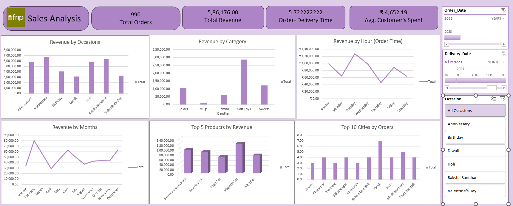

# Ferns & Petals (FNP) Sales Analysis  
### End-to-End Data & Business Analytics Project using Microsoft Excel (Power Query + Power Pivot)

---

## Project Summary

This project analyzes transactional sales data from Ferns & Petals (FNP), an occasion-based e-commerce gifting company operating across multiple Indian cities.

The objective was to independently execute the complete analytics workflow — from raw data extraction and transformation to interactive dashboard development — and generate actionable business insights related to:

- Revenue performance  
- Product contribution  
- Seasonal demand patterns  
- Customer spending behavior  
- Geographic sales distribution  
- Operational efficiency  

The entire solution was built using Microsoft Excel, leveraging advanced features typically used in Business Intelligence workflows.

---

## Dashboard Preview

---

## Business Questions Addressed

1. What is the total revenue generated?
2. What is the average order-to-delivery time?
3. How does monthly sales performance fluctuate?
4. Which products generate the highest revenue?
5. What is the average customer spending?
6. Which cities contribute the highest number of orders?
7. How does revenue vary across occasions?
8. Does higher order quantity impact delivery time?

---

## Data Preparation & Modeling

### Data Cleaning & Transformation (Power Query)

- Removed duplicate and inconsistent records  
- Standardized date formats  
- Corrected data types for modeling  
- Derived calculated fields:
  - Delivery Duration (Delivery Date – Order Date)
  - Order Month
  - Occasion segmentation  

The dataset was transformed into an analysis-ready format prior to loading into the data model.

---

### Data Modeling (Power Pivot)

- Built relational data model between Orders, Products, Customers, and Dates  
- Created DAX measures including:
  - Total Revenue  
  - Total Orders  
  - Average Customer Spend  
  - Average Delivery Time  
  - Revenue by Occasion  
  - Revenue by Category  

Using Power Pivot allowed Excel to function as a structured BI engine rather than a flat spreadsheet.

---

## Key Insights

### Overall Performance (2023)

- **Total Orders:** 990  
- **Total Revenue:** ₹5,86,176  
- **Average Customer Spend:** ₹4,652  
- **Average Delivery Time:** 5.72 Days  

Revenue per customer indicates strong bundled-product purchasing behavior.

---

### Revenue by Occasion

- Highest Revenue: Anniversary & Raksha Bandhan  
- Strong Contribution: Holi  
- Relatively Lower: Diwali & Valentine’s Day  

Relationship-driven occasions generate stronger revenue than high-volume commercial festivals, suggesting targeted premium marketing opportunities.

---

### Revenue by Category

- Top Category: Soft Toys  
- Moderate Contribution: Sweets, Colors  
- Lowest Contribution: Mugs  

Customers demonstrate preference toward emotionally symbolic gifting products over utility-based items.

---

### Monthly Sales Trend

Sales spikes observed during:
- February  
- June  
- December  

Noticeable dip around April.

Demand is clearly seasonal and event-driven, highlighting the importance of inventory planning aligned with occasion clusters.

---

### Top 5 Products by Revenue

Bundled gift sets dominate revenue contribution, reinforcing the effectiveness of curated packaging strategies.

---

### Top Cities by Orders

Order distribution indicates strong participation from Tier-2 and Tier-3 cities, suggesting scalable regional market penetration beyond metropolitan areas.

---

## Operational Analysis – Order Quantity vs Delivery Time

Average delivery time remains approximately 5.72 days across the dataset.

Initial exploratory analysis indicates no visible spike in delivery duration across different order volumes. However, a formal statistical correlation or regression analysis between order quantity and delivery time would be required to conclusively validate supply chain scalability under higher demand conditions.

This represents a potential analytical extension of the project.

---

## Tools & Technologies Used

- Microsoft Excel  
- Power Query (ETL & Data Transformation)  
- Power Pivot (Data Modeling)  
- DAX Measures  
- Pivot Tables & Charts  
- Interactive Dashboard Design  

---

## Skills Demonstrated

- End-to-end data cleaning and transformation  
- Data modeling using Power Pivot  
- KPI creation using DAX  
- Business problem translation into measurable metrics  
- Interactive dashboard development  
- Insight generation for strategic decision-making  

---

## Project Impact

This project demonstrates the ability to independently manage the full analytics lifecycle — from raw data transformation to executive-level reporting — using Excel as a structured Business Intelligence tool.
